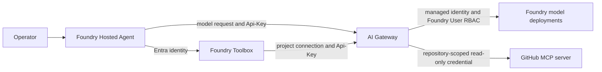

# Implementation Notes

These notes describe the public architecture, preview contracts, security
boundaries, configuration, and validation steps for the sample.

## Runtime shape

This repository contains a Foundry Hosted Agent. It does not include an Azure
Functions application.

- `main.py` starts an Agent Framework `ResponsesHostServer`.
- `repo_digest_agent.py` creates the agent, calls the AI Gateway model route,
  and connects to Foundry Toolbox.
- `github_mcp_middleware.py` bounds GitHub tool arguments and compacts results
  before the follow-up model call.
- `github_credential_validator.py` accepts only fine-grained personal access
  token and GitHub App installation token formats, checks coarse repository
  roles, and exercises the required read endpoints.
- `toolbox.yaml` declares the Foundry Toolbox GitHub MCP source.
- `agent.yaml` describes the hosted agent.
- `azure.yaml` declares the Foundry project, hosted agent, scheduled routine,
  Bicep provider, and deployment hooks.
- `infra/main.bicep` is the subscription-scope deployment entry point.
- `infra/foundry-models/main.bicep` creates the model-serving Foundry account
  and deployments.
- `infra/foundry-agents/main.bicep` creates the agent project, storage,
  Container Registry, monitoring, connections, and RBAC.
- `infra/ai-gateway/main.bicep` creates AI Gateway, its Connector Namespace,
  model provider, model registrations, runtime key, and monitoring.
- `chat.py` is a local console client for the Responses endpoint.

The scheduled routine is named `daily-repo-digest`. It runs at 9 AM in the
configured timezone and asks the agent for a digest of
`microsoft/agent-framework`. The Responses API also supports interactive
requests.

## Request path



Model requests use
`<gateway>/default/models/openai/v1/chat/completions` or the corresponding
Responses route. Tool requests use
`<gateway>/default/toolservers/github/mcp`.

The agent does not call a Foundry model endpoint directly. This keeps model
traffic behind AI Gateway policies. `FoundryChatClient` is intentionally not
used for model inference.

## Foundry Toolbox

The tool path is:

```text
Agent -> Foundry Toolbox -> AI Gateway -> GitHub MCP
```

`toolbox.yaml` declares one MCP source backed by the `aigw-github` project
connection. The postprovision hook stores the AI Gateway `Api-Key` in that
connection. `FoundryToolbox` authenticates the agent-to-Toolbox request with
Entra identity.

The GitHub source sets `require_approval: "never"` because all four exposed
operations are read-only and the scheduled routine cannot pause for approval.
AI Gateway also injects:

- `X-MCP-Readonly: true`
- `X-MCP-Tools: search_repositories,list_pull_requests,search_issues,actions_list`
- `failureMode: failClosed`

Tool Search is not enabled. The agent has only four known tools and calls all
four in one parallel tool round, so discovery would add latency without
reducing the initial schema enough to help.

## GitHub credential boundary

The GitHub backend credential must be a fine-grained personal access token or
GitHub App installation token limited to the repository being summarized. It
needs read-only access for:

- Metadata
- Actions
- Contents
- Issues
- Pull requests

Do not grant repository write, administration, organization administration,
workflow write, or classic `repo` scope.

During postprovision, the hook obtains the credential from GitHub CLI. `GH_TOKEN`
can supply an ephemeral token for local or CI deployment. A dedicated GitHub
CLI account can be selected with `GITHUB_MCP_GH_USER`.

Before storing the credential in the ToolServer, the validator:

1. Requires `GITHUB_REPOSITORY` to use `owner/repository` syntax.
2. Accepts only `github_pat_` fine-grained personal access tokens and `ghs_`
   GitHub App installation access tokens.
3. Calls the GitHub repository API with the selected credential.
4. Requires repository read access.
5. Rejects `admin`, `maintain`, `push`, or `triage` repository permissions.
6. Exercises the Contents, Issues, Pull requests, and Actions runs endpoints.
7. Fails when GitHub is unreachable or returns an unexpected response.

GitHub does not return the complete selected-repository boundary in that API
response, and it does not expose every granular write permission through the
coarse repository role flags. The operator must create the fine-grained token
or installation token for only that repository with only the documented
read-only permissions.

The GitHub credential is used only to configure the AI Gateway ToolServer. It
is not written to Bicep outputs, the azd environment, `.env`, or hosted-agent
environment variables. The target repository in the agent prompt is
configuration, not an authorization boundary.

## AI Gateway Bicep contracts

The root deployment creates three resource groups:

- `foundryagents` for the Foundry project, agent hosting, storage, Container
  Registry, and hosted-agent monitoring.
- `foundrymodels` for the separate Foundry model account and deployments.
- `gateway` for AI Gateway, Connector Namespace, Gateway monitoring, model
  provider, and model registrations.

The only cross-group runtime authorization is the AI Gateway system identity's
Foundry User role assignment on the model account. The public Azure
role-definition ID used by the template is
`53ca6127-db72-4b80-b1b0-d745d6d5456d`.

The AI Gateway module uses these preview contracts:

- `Microsoft.ApiManagement/service@2025-09-01-preview`
- SKU `AIGateway` with capacity `1`
- `Microsoft.ApiManagement/service/workspaces/modelProviders@2025-09-01-preview`
- `Microsoft.ApiManagement/service/workspaces/modelProviders/models@2025-09-01-preview`
- `Microsoft.ApiManagement/service/workspaces/toolServers@2025-09-01-preview`
- `Microsoft.ApiManagement/service/apiKeys@2025-09-01-preview`
- `Microsoft.Web/connectorGateways@2026-05-01-preview`

The Connector Namespace uses the same name, resource group, and location as
the APIM AI Gateway service. It is a separate resource from the GitHub MCP
ToolServer and supports connector-backed scenarios.

The default workspace is implicit for control-plane child resources. The
postprovision hook waits for the workspace child collection before configuring
the GitHub ToolServer.

The Foundry model provider uses:

- `kind: Foundry`
- The model account endpoint returned by Azure
- Foundry account and deployment resource IDs
- `authentication.kind: ManagedIdentity`
- Token resource `https://cognitiveservices.azure.com/`

Each model registration includes:

- `apiFormat: OpenAIChatCompletions`
- `/openai/v1/chat/completions`
- `/openai/v1/responses`
- A token-limit policy derived from deployment capacity
- `deployment.modelName` set to the Foundry deployment name from the final
  segment of the deployment resource ID

The deployment name, not the backing catalog model name, is the OpenAI `model`
value sent through AI Gateway.

## Regions and model defaults

The default split is:

- Foundry, storage, Container Registry, and monitoring: `eastus2`
- AI Gateway and Connector Namespace: `eastus2euap`

The Foundry region allowlist is:

- `eastus`
- `eastus2`
- `westus`
- `northcentralus`
- `swedencentral`
- `japaneast`

The AI Gateway preview region allowlist is:

- `westus2`
- `westus3`
- `eastus`
- `centraluseuap`
- `eastus2euap`
- `westcentralus`
- `swedencentral`
- `eastus2`

The model defaults are:

| Purpose | Gateway deployment | Backing model | Version | Capacity |
| --- | --- | --- | --- | --- |
| Full | `gpt-latest` | `gpt-5.6-sol` | `2026-07-09` | 20 |
| Mini | `gpt-mini-latest` | `gpt-5.4-mini` | `2026-03-17` | 200 |

If `gpt-5.6-sol` is unavailable, set `modelName=gpt-5.5` and
`modelVersion=2026-04-24`.

Global Standard capacity maps to the Gateway token limit at 1,000 tokens per
minute per capacity unit. Capacity 20 therefore registers 20,000 tokens per
minute for the full deployment. Mini capacity 200 accommodates requests from
the GitHub Copilot app, also called ghapp, when built-in tool definitions make
the prompt substantially larger.

The agent caps each response at 2,048 output tokens. Azure quota evaluation
uses an estimate based on the prompt and requested maximum output, so this cap
reduces avoidable reservation pressure on the follow-up call after MCP tool
execution.

## Runtime key handling

Bicep creates `apiKeys/default`. The postprovision hook retrieves the Gateway
key through `listSecrets` and retains `listValues` as a preview-contract
fallback. It can reuse the saved azd environment value when a later
reprovision cannot retrieve the value again.

The Gateway key is sent in the explicit `Api-Key` header. It is not sent as
`Authorization: Bearer`. The backing Foundry account has local authentication
disabled, and provisioning does not call the Foundry `listKeys` action.

The runtime fails when the Gateway endpoint or key is missing. It has no direct
Foundry fallback.

## AI Gateway deletion lifecycle

APIM deletion can include a live service phase, a soft-deleted service phase,
and an identity cleanup interval. Name availability alone does not prove that
identity cleanup has completed.

`azure.yaml` invokes the lifecycle scripts in two paths:

- Preprovision preserves a succeeded Gateway and removes only a terminal
  failed Gateway that matches the current azd environment ownership markers.
- Postdown completes the explicit teardown, waits for the live resource to
  disappear, purges the soft-deleted APIM service, and waits for identity
  cleanup.

The scripts use bounded exponential polling. Defaults are:

- Initial interval: 5 seconds
- Maximum interval: 30 seconds
- Identity quiet window: 180 seconds
- Total operation bound: 900 seconds

Tests can override these values with:

- `APIM_LIFECYCLE_POLL_INITIAL_SECONDS`
- `APIM_LIFECYCLE_POLL_MAX_SECONDS`
- `APIM_LIFECYCLE_IDENTITY_SETTLE_SECONDS`
- `APIM_LIFECYCLE_OPERATION_TIMEOUT_SECONDS`

The nonsecret `.azure/<environment>/apim-lifecycle.state` marker contains only
environment and resource identity, location, lifecycle state, time, and a
deployment or resource failure identifier.

Relevant public documentation:

- [Azure API Management soft-delete](https://learn.microsoft.com/azure/api-management/soft-delete)
- [Deleted Services - Get By Name](https://learn.microsoft.com/rest/api/apimanagement/deleted-services/get-by-name?view=rest-apimanagement-2024-05-01)
- [Deleted Services - Purge](https://learn.microsoft.com/rest/api/apimanagement/deleted-services/purge?view=rest-apimanagement-2024-05-01)

## Hosted-agent image and monitoring

The hosted agent uses `language: docker` and `docker.remoteBuild: true`. The
Foundry module creates a Premium Container Registry with admin credentials
disabled, grants the Foundry project identity `AcrPull`, and creates a
project-scoped managed-identity Container Registry connection.

The developer running a remote build needs Container Registry Tasks
Contributor or an inherited broader role on the registry.

The agent and Gateway use separate Log Analytics workspaces and workspace-based
Application Insights components. Gateway payload capture is disabled. Each
platform boundary owns its telemetry.

## Environment variables

The azd environment contains deployment metadata. Do not distribute its
`.azure/<environment>/.env` file.

Create the smaller local development file with:

```bash
./scripts/create-dev-env.sh
```

or:

```powershell
pwsh ./scripts/create-dev-env.ps1
```

The scripts refuse to overwrite `.env` unless explicitly forced, restrict the
file to the current user, and do not print the Gateway key.

The local file contains:

```bash
AZURE_AI_GATEWAY_ENDPOINT="https://<gateway-host-name>/"
AZURE_AI_GATEWAY_API_KEY="<gateway-api-key>"
AZURE_AI_GATEWAY_MODEL="gpt-latest"
AZURE_AI_GATEWAY_MINI_MODEL="gpt-mini-latest"

TOOLBOX_ENDPOINT="https://<foundry-toolbox-endpoint>"
TOOLBOX_NAME="repo-digest-tools"

GITHUB_REPOSITORY="<owner>/<repository>"
```

For direct local execution, `main.py` disables only Microsoft OpenTelemetry SDK
self-telemetry when the Foundry hosting marker is absent. Hosted observability
remains enabled in Foundry.

## Validation

Run:

```bash
git diff --check
uv sync --frozen
uv run python -m compileall -q .
uv run python -m unittest discover -s tests
bash tests/test-apim-lifecycle.sh
bash tests/test-ai-gateway-model-registration.sh
az bicep build --file infra/foundry-agents/main.bicep
az bicep build --file infra/ai-gateway/main.bicep
az bicep build --file infra/foundry-models/main.bicep
az bicep build --file infra/main.bicep
docker build .
```
